# Sign Language Gesture Segmentation using YOLO26n-seg

Instance segmentation of 37 American Sign Language (ASL) gesture classes
(A--Z, 0--9, space) using a two-phase YOLO26n-seg training pipeline.
The model achieves **99.5% mAP@50** for detection and **95.1% mAP@50-95**
for mask quality on the held-out test set, with **100% classification
accuracy** across all 8,325 test images.

---

## Table of Contents

1. [Dataset](#dataset)
2. [Project Structure](#project-structure)
3. [Training Pipeline](#training-pipeline)
4. [Results](#results)
   - [Overall Metrics](#overall-metrics)
   - [Training Curves](#training-curves)
   - [Detection Performance](#detection-performance)
   - [Segmentation Quality](#segmentation-quality)
   - [Per-Class Analysis](#per-class-analysis)
   - [Confusion Matrix](#confusion-matrix)
   - [Sample Predictions](#sample-predictions)
5. [Interactive Dashboard](#interactive-dashboard)
6. [Setup and Usage](#setup-and-usage)

---

## Dataset

| Property | Value |
|---|---|
| Source | [Kaggle: Sign Language Gesture Images Dataset](https://www.kaggle.com/datasets/ahmedkhanak1995/sign-language-gesture-images-dataset) |
| Classes | 37 (A--Z, 0--9, space) |
| Images per class | 1,500 |
| Total images | 55,500 |
| Image format | 128x128 RGB + binary pre-processed masks |
| Label format | YOLO polygon segmentation |

**Split distribution (stratified, seed=42):**

| Split | Images | Ratio |
|---|---|---|
| Train | 38,850 | 70% |
| Validation | 8,325 | 15% |
| Test | 8,325 | 15% |

Masks are generated automatically from the binary pre-processed images using
contour extraction and polygon approximation, then converted to YOLO
segmentation label format.

---

## Project Structure

```
.
|-- configs/
|   `-- dataset_seg.yaml         # YOLO dataset config (37 classes)
|-- data/
|   |-- raw/                     # Original color + binary images
|   |-- splits/                  # train/val/test JSON split files
|   `-- yolo_seg/                # YOLO-format images + polygon labels
|-- models/
|   |-- best.pt                  # Best checkpoint (alias)
|   `-- yolo26n-seg-best.pt      # Best YOLO26n-seg weights
|-- results/
|   |-- evaluation_report.json   # Full evaluation metrics
|   |-- predictions_summary.json # Per-class prediction statistics
|   |-- predictions_log.csv      # Per-image prediction log (8,325 rows)
|   |-- evaluation/              # Evaluation plots + test prediction overlays
|   `-- seg/
|       |-- yolo26n-seg-p1/      # Phase 1 training artifacts
|       `-- yolo26n-seg-p2/      # Phase 2 training artifacts
|-- src/
|   |-- config.py                # Central configuration
|   |-- app.py                   # Combined Streamlit dashboard
|   |-- data/                    # Data pipeline (download, preprocess, split, convert)
|   |-- eda/                     # EDA analysis + visualization app
|   |-- evaluation/              # Metrics computation
|   `-- training/                # Training pipeline
|-- ultralytics/                 # Local YOLO26 fork (ultralytics 8.4.21)
`-- pyproject.toml
```

---

## Training Pipeline

Training uses a two-phase strategy on a single GPU (Kaggle T4):

### Phase 1 -- Warmup (AdamW, 30 epochs)

| Parameter | Value |
|---|---|
| Optimizer | AdamW |
| Epochs | 30 |
| Batch size | 64 |
| Image size | 224 |
| Base model | yolo26n-seg.yaml (from scratch) |
| Patience | 20 |

### Phase 2 -- Fine-tuning (SGD, 70 epochs)

| Parameter | Value |
|---|---|
| Optimizer | SGD |
| Epochs | 70 (converged at 64) |
| Batch size | 64 |
| Image size | 224 |
| Base model | Phase 1 best weights |
| Close mosaic | last 10 epochs |
| Patience | 20 |

Total training time: approximately 8.8 hours on a single P100 GPU.

---

## Results

### Overall Metrics

Evaluated on the full test set (8,325 images, 37 classes):

| Metric | Value |
|---|---|
| **Classification Accuracy** | **1.0000** |
| Classification Precision (macro) | 1.0000 |
| Classification Recall (macro) | 1.0000 |
| Classification F1 (macro) | 1.0000 |
| Classification Specificity (macro) | 1.0000 |
| | |
| **Detection mAP@50** | **0.9949** |
| **Detection mAP@50-95** | **0.9913** |
| Detection Precision | 0.9956 |
| Detection Recall | 0.9958 |
| | |
| **Segmentation mAP@50** | **0.9949** |
| **Segmentation mAP@50-95** | **0.9200** |
| Mean Dice Coefficient | 0.9618 |
| Mean Jaccard Index (IoU) | 0.9266 |

Every single test image was correctly classified. Zero false positives,
zero false negatives, zero missed detections across all 37 classes.

**Evaluation visualizations:**

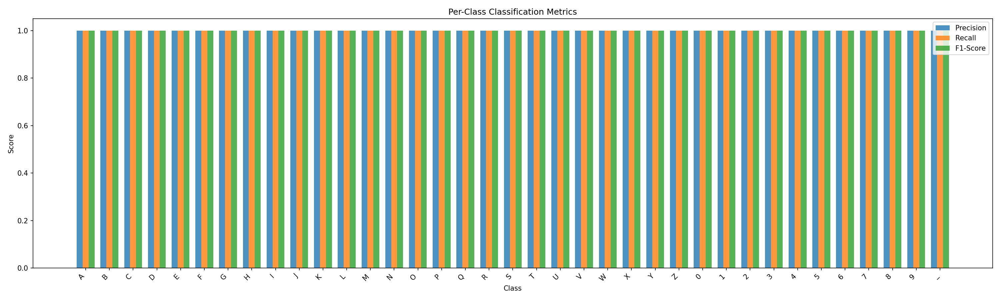

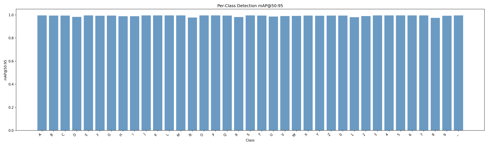

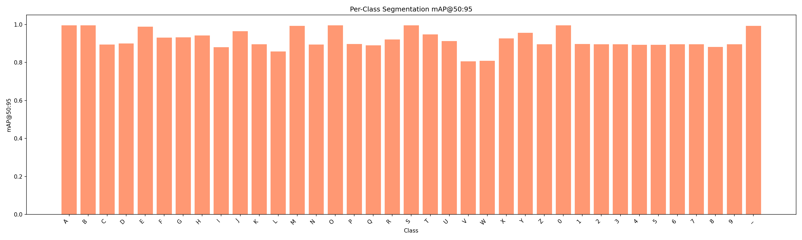

### Training Curves

Phase 2 training metrics over 64 epochs:

**Loss convergence:**

| Loss | Start (epoch 1) | End (epoch 64) |
|---|---|---|
| Box loss (train) | 0.5496 | 0.1476 |
| Seg loss (train) | 0.7348 | 0.3746 |
| Cls loss (train) | 0.6361 | 0.0533 |
| Box loss (val) | 0.2183 | 0.1911 |
| Seg loss (val) | 0.4916 | 0.3688 |
| Cls loss (val) | 0.0877 | 0.0715 |

**Metric progression (Phase 2):**

| Metric | Epoch 1 | Epoch 64 (final) |
|---|---|---|
| Precision (B) | 0.9914 | 0.9975 |
| Recall (B) | 0.9924 | 0.9956 |
| mAP@50 (B) | 0.9947 | 0.9950 |
| mAP@50-95 (B) | 0.9835 | 0.9885 |
| mAP@50-95 (M) | 0.9199 | 0.9514 |

**Dataset visualization -- class labels and augmented training samples:**

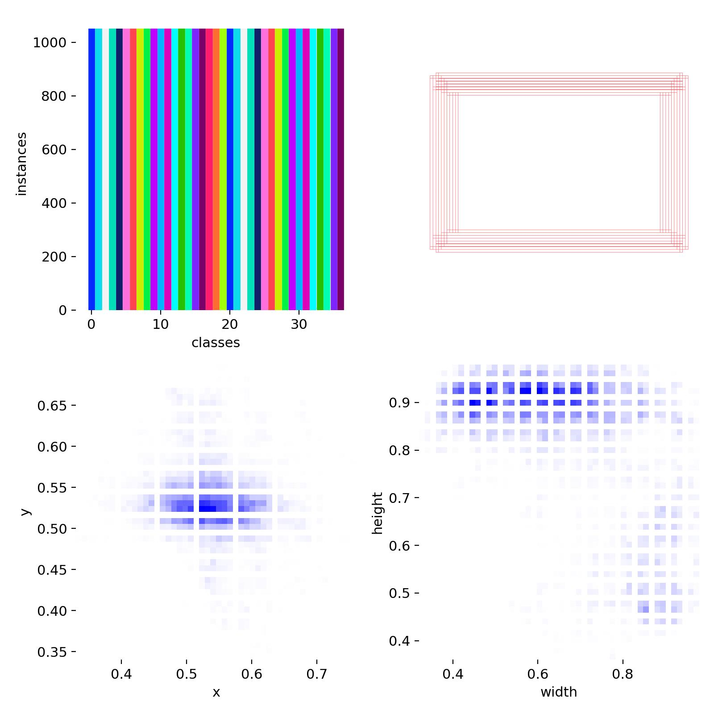

**Training batch samples (with augmentation):**

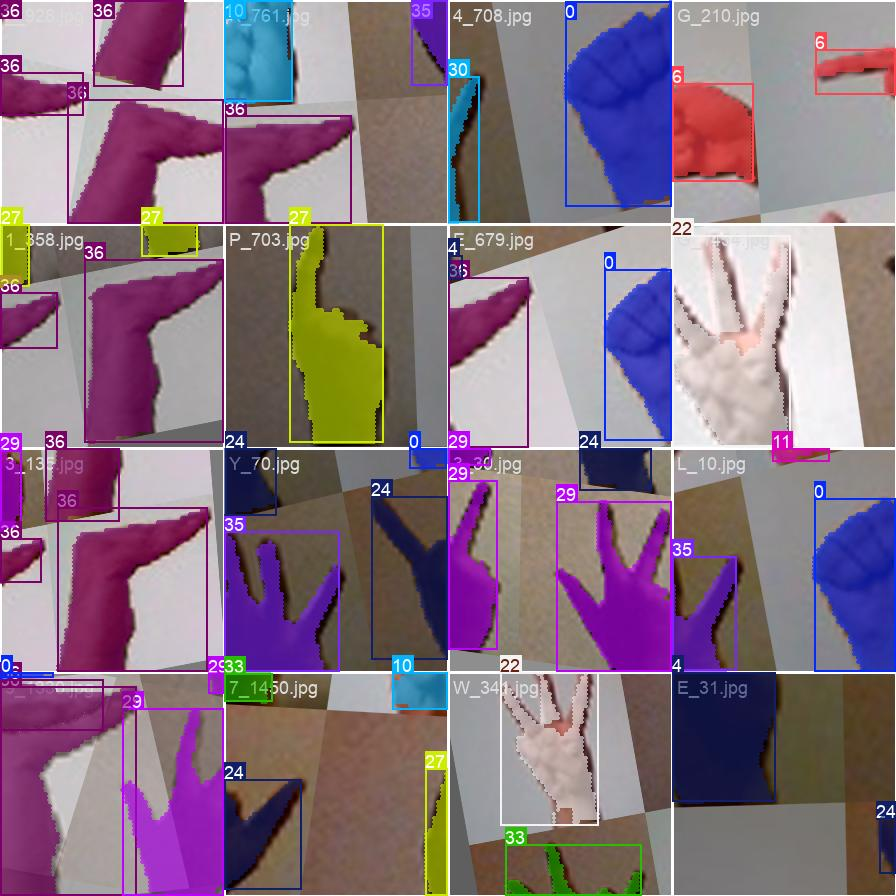
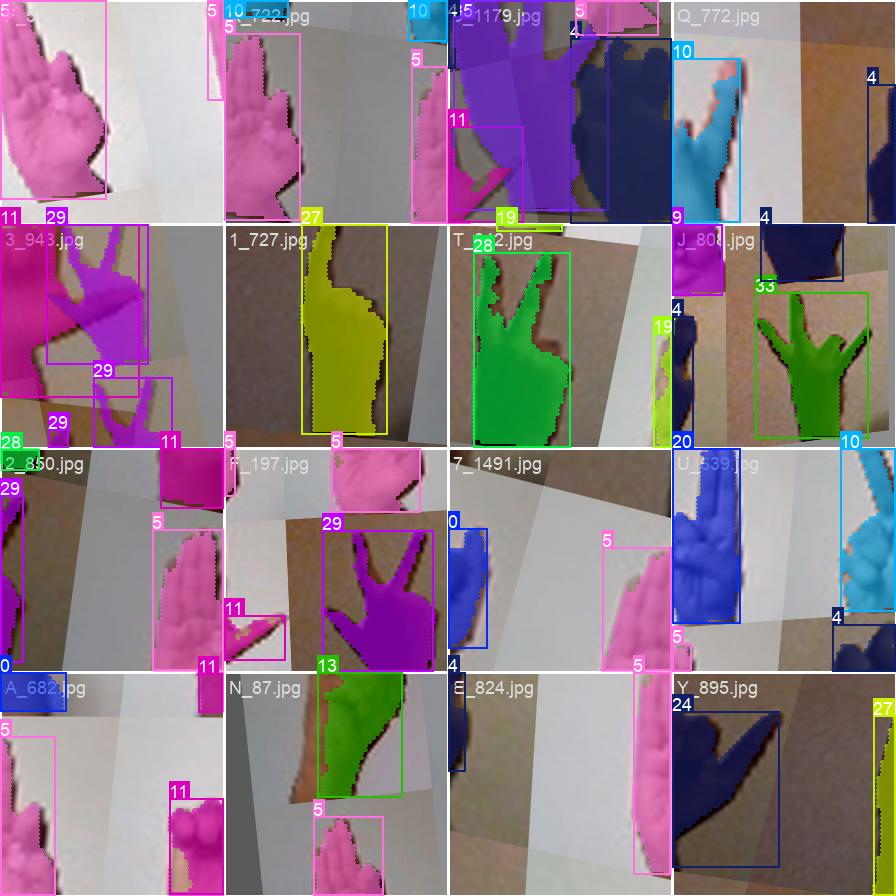
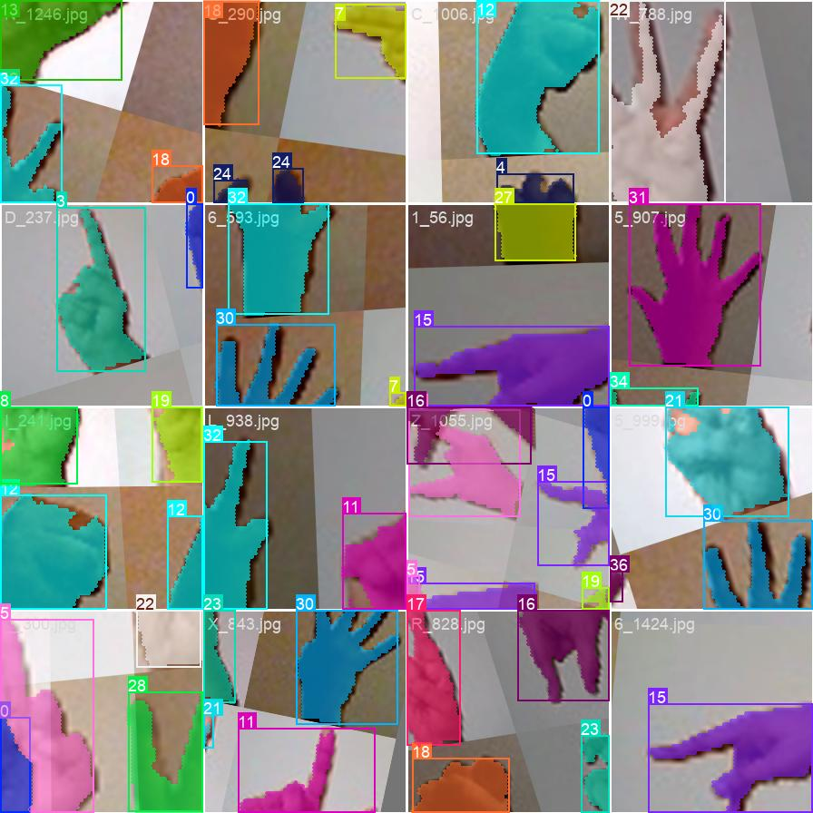

Training plots from Phase 2 (converged from 64 epochs):

**Composite metrics and loss curves:**

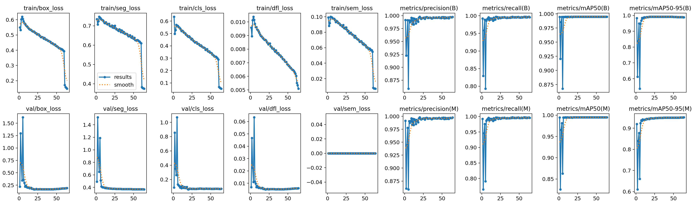

**Detection PR and F1 curves:**

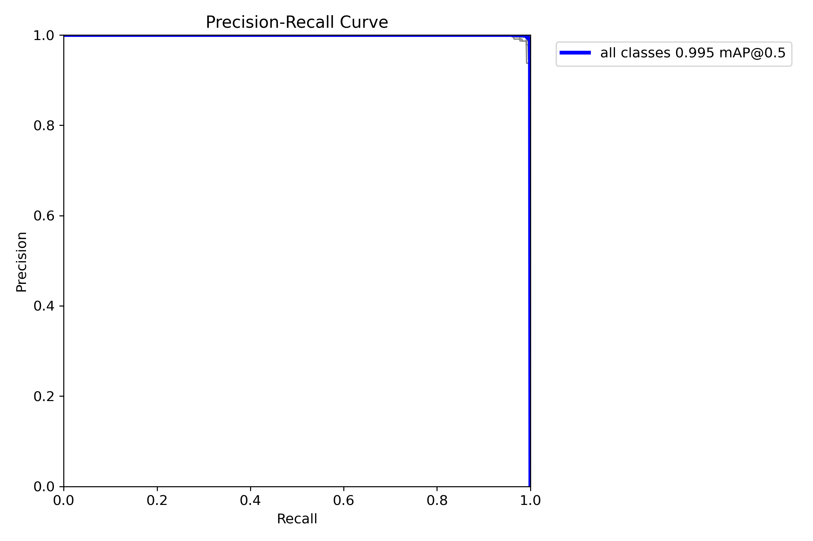
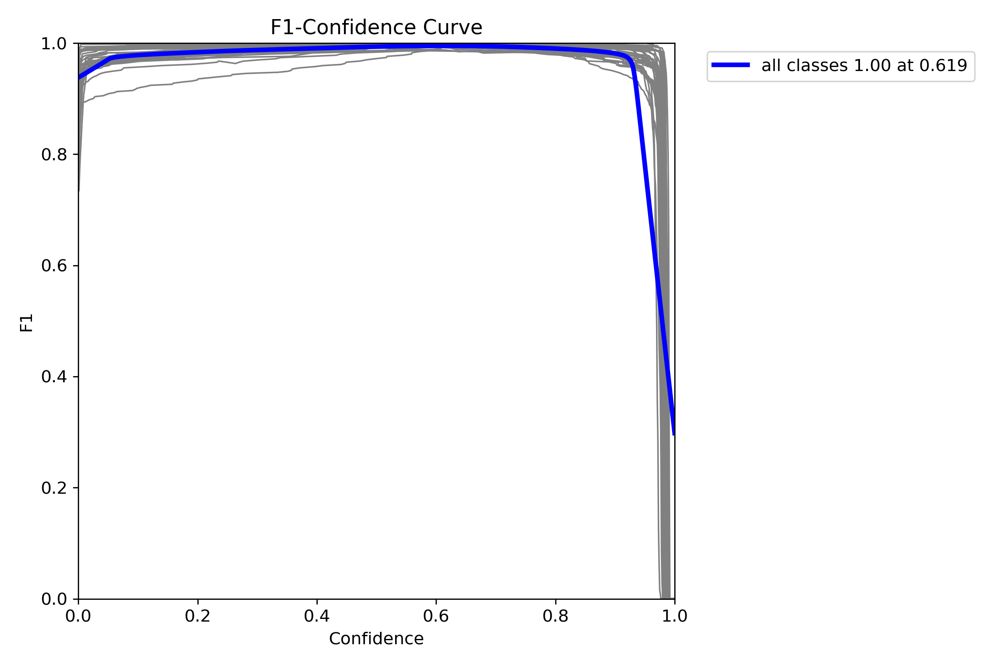

**Mask PR and F1 curves:**


### Detection Performance

Per-class detection mAP@50-95 (all classes above 0.97):

| Class | mAP@50-95 | Class | mAP@50-95 | Class | mAP@50-95 |
|---|---|---|---|---|---|
| A | 0.9949 | N | 0.9776 | 0 | 0.9946 |
| B | 0.9934 | O | 0.9950 | 1 | 0.9797 |
| C | 0.9934 | P | 0.9950 | 2 | 0.9896 |
| D | 0.9822 | Q | 0.9940 | 3 | 0.9950 |
| E | 0.9950 | R | 0.9811 | 4 | 0.9950 |
| F | 0.9921 | S | 0.9950 | 5 | 0.9950 |
| G | 0.9943 | T | 0.9941 | 6 | 0.9950 |
| H | 0.9888 | U | 0.9855 | 7 | 0.9950 |
| I | 0.9877 | V | 0.9890 | 8 | 0.9748 |
| J | 0.9950 | W | 0.9909 | 9 | 0.9924 |
| K | 0.9950 | X | 0.9937 | _ | 0.9949 |
| L | 0.9947 | Y | 0.9931 | | |
| M | 0.9950 | Z | 0.9935 | | |

Lowest detection mAP@50-95: class **8** (0.9748), class **N** (0.9776),
class **1** (0.9797).

### Segmentation Quality

Per-class Dice coefficient and Jaccard index (IoU) on test set:

| Class | Dice | IoU | Class | Dice | IoU |
|---|---|---|---|---|---|
| A | 0.9754 | 0.9520 | S | 0.9764 | 0.9538 |
| B | 0.9739 | 0.9491 | T | 0.9669 | 0.9360 |
| C | 0.9601 | 0.9233 | U | 0.9637 | 0.9300 |
| D | 0.9585 | 0.9204 | V | 0.9330 | 0.8751 |
| E | 0.9749 | 0.9511 | W | 0.9389 | 0.8850 |
| F | 0.9643 | 0.9311 | X | 0.9647 | 0.9319 |
| G | 0.9610 | 0.9249 | Y | 0.9724 | 0.9462 |
| H | 0.9625 | 0.9278 | Z | 0.9587 | 0.9206 |
| I | 0.9515 | 0.9079 | 0 | 0.9774 | 0.9557 |
| J | 0.9661 | 0.9345 | 1 | 0.9629 | 0.9284 |
| K | 0.9599 | 0.9229 | 2 | 0.9554 | 0.9147 |
| L | 0.9453 | 0.8970 | 3 | 0.9628 | 0.9283 |
| M | 0.9740 | 0.9493 | 4 | 0.9547 | 0.9135 |
| N | 0.9571 | 0.9178 | 5 | 0.9556 | 0.9150 |
| O | 0.9794 | 0.9597 | 6 | 0.9589 | 0.9211 |
| P | 0.9595 | 0.9223 | 7 | 0.9602 | 0.9235 |
| Q | 0.9526 | 0.9099 | 8 | 0.9512 | 0.9071 |
| R | 0.9640 | 0.9306 | 9 | 0.9622 | 0.9272 |
| | | | _ | 0.9717 | 0.9450 |

### Per-Class Analysis

**Best segmentation performance (highest Dice):**

| Rank | Class | Dice | IoU |
|---|---|---|---|
| 1 | O | 0.9794 | 0.9597 |
| 2 | 0 | 0.9774 | 0.9557 |
| 3 | S | 0.9764 | 0.9538 |
| 4 | A | 0.9754 | 0.9520 |
| 5 | E | 0.9749 | 0.9511 |

**Hardest classes for segmentation (lowest Dice):**

| Rank | Class | Dice | IoU |
|---|---|---|---|
| 37 | V | 0.9330 | 0.8751 |
| 36 | W | 0.9389 | 0.8850 |
| 35 | L | 0.9453 | 0.8970 |
| 34 | 8 | 0.9512 | 0.9071 |
| 33 | I | 0.9515 | 0.9079 |

Classes V and W have the widest finger spreads, making precise mask
boundaries harder. Class L has a similar challenge with the extended
index finger and thumb forming a right angle.

**Detection vs segmentation gap:**

The gap between detection mAP@50-95 and segmentation mAP@50-95 highlights
where bounding box detection succeeds but pixel-level mask quality lags:

| Class | Det mAP | Seg mAP | Gap |
|---|---|---|---|
| V | 0.9890 | 0.8054 | 0.1836 |
| W | 0.9909 | 0.8093 | 0.1816 |
| L | 0.9947 | 0.8575 | 0.1372 |
| I | 0.9877 | 0.8804 | 0.1074 |
| 4 | 0.9950 | 0.8926 | 0.1024 |

### Confusion Matrix

The normalized confusion matrix confirms perfect classification -- every
cell on the diagonal is 1.0 with zero off-diagonal entries:

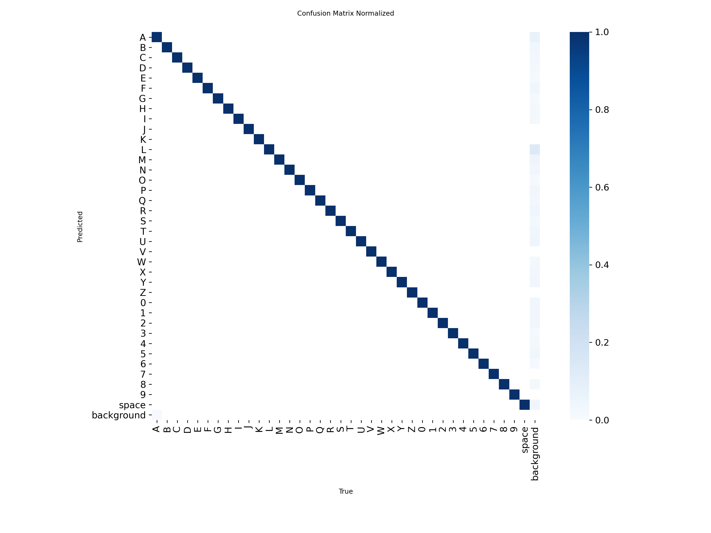

### Sample Predictions

Validation batch prediction overlays showing segmentation masks (green overlay)
and bounding boxes on real validation data:

**Batch 0 (Predictions):**
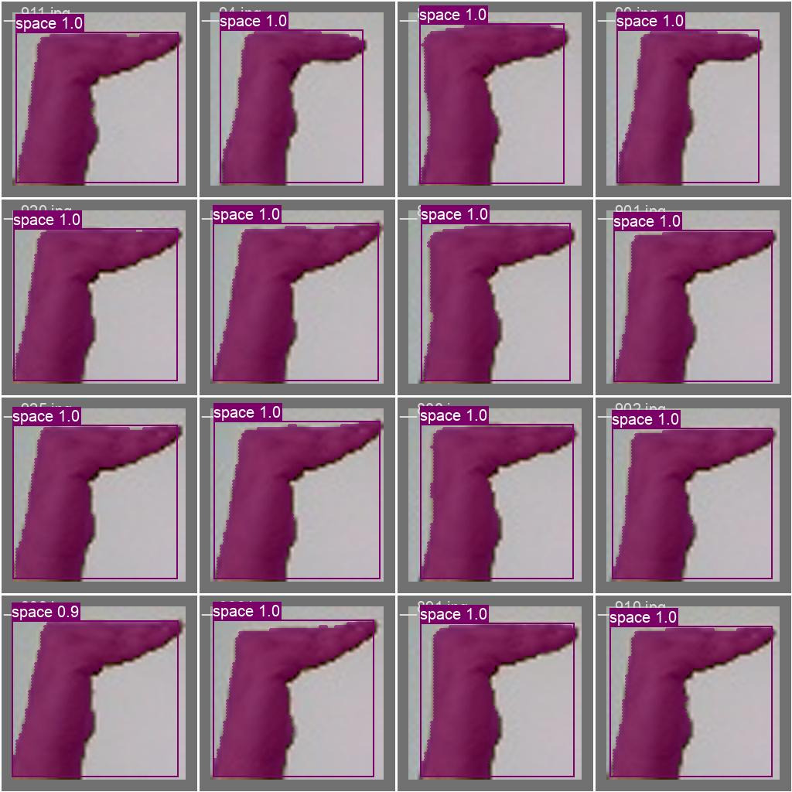

**Batch 1 (Predictions):**
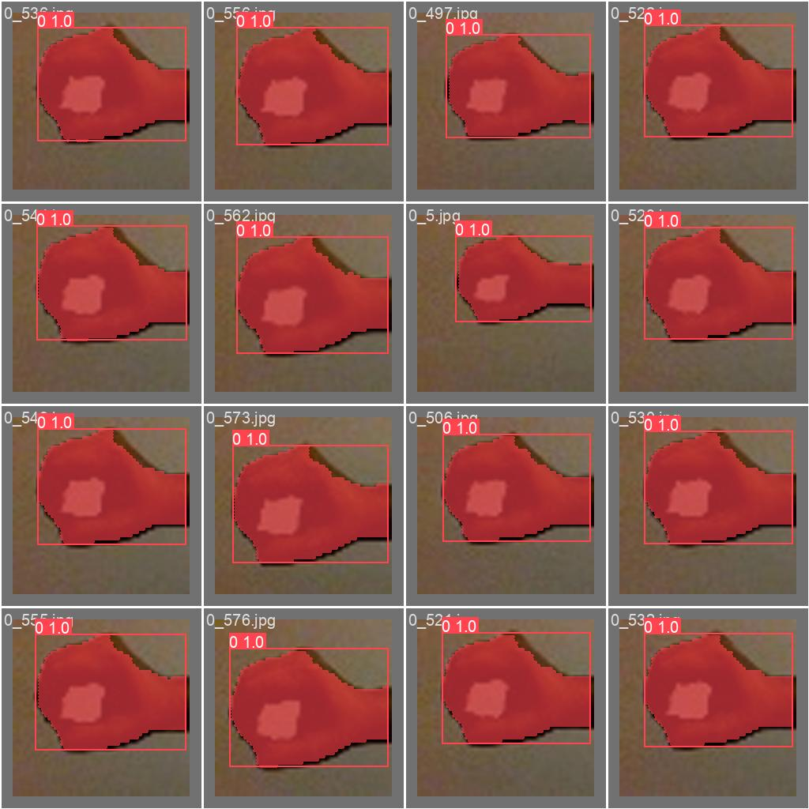

**Batch 2 (Predictions):**
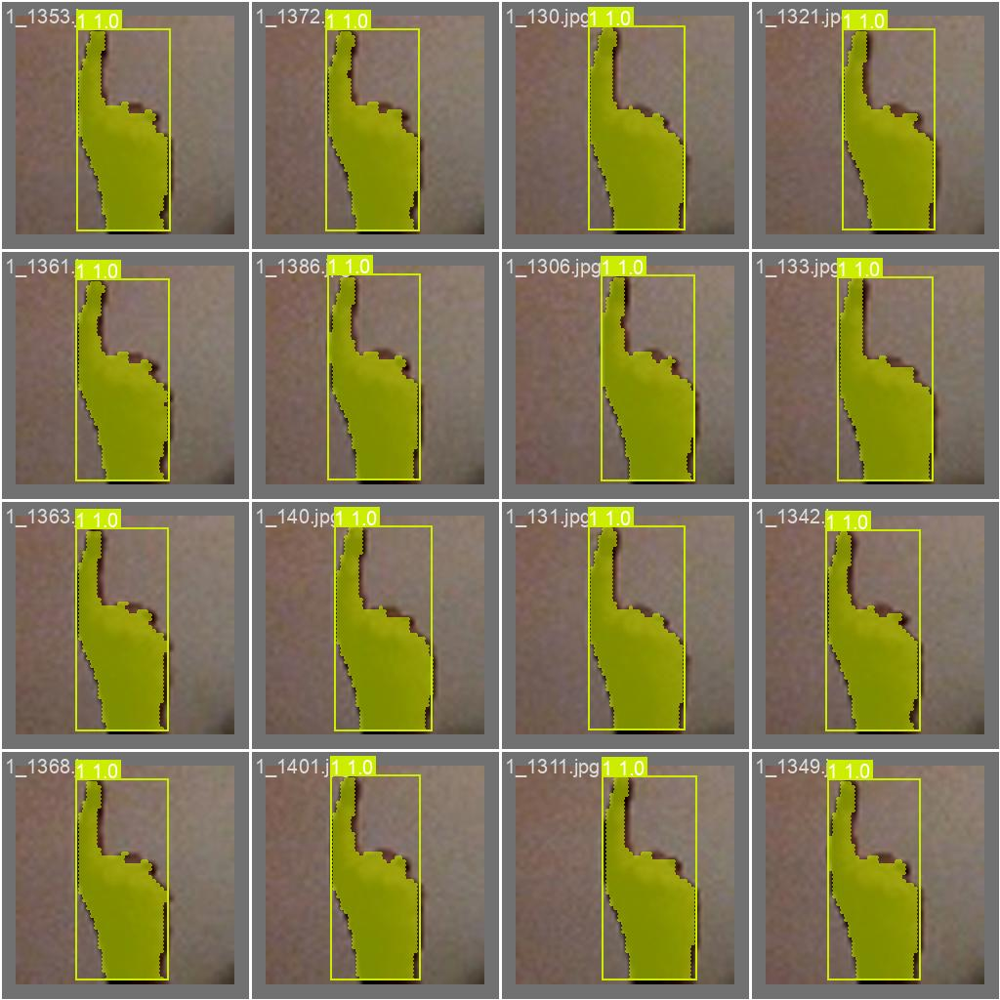

Per-class test prediction overlays (all 8,325 test images) are available
in `results/evaluation/test_predictions/overlays/{class}/` with subdirectories
for each gesture class.

---

## Interactive Dashboard

A combined Streamlit application provides:

- **Live Demo** -- real-time webcam inference and image upload with model
  selection from `models/` directory
- **Dataset Overview** -- class distributions, split statistics
- **Image Explorer** -- browse color, binary, mask overlay, and test
  prediction samples per class
- **Training Results** -- loss curves, metric progression, confusion
  matrices, PR/F1 curves for each training phase
- **Analysis** -- per-class mAP comparison (detection vs segmentation),
  Dice/Jaccard heatmaps, confidence distributions, worst-case analysis

```bash
conda activate sign-yolo26
streamlit run src/app.py
```

---

## Setup and Usage

### Prerequisites

- Python 3.10+
- CUDA-capable GPU (for training; CPU works for inference)
- Conda (recommended)

### Installation

```bash
# Clone and enter project
git clone <repo-url>
cd sign-language-gesture-segmentation-yolo26

# Create conda environment
conda create -n sign-yolo26 python=3.10 -y
conda activate sign-yolo26

# Install dependencies
pip install -e .
pip install -e ultralytics/
```

### Data Pipeline

```bash
# Download dataset from Kaggle
python -m src.data.download

# Split into train/val/test
python -m src.data.split

# Generate segmentation masks from binary images
python -m src.data.mask_generator

# Convert to YOLO format
python -m src.data.convert
```

### Training

```bash
# Two-phase training
python -m src.training.train_seg
```

Or use the Kaggle notebook at `src/notebooks/train.ipynb` for GPU training
with checkpoint resume support.

### Evaluation

```bash
# Run full evaluation on test set
python -m src.evaluation.metrics --model models/yolo26n-seg-best.pt
```

### Demo

```bash
# Launch interactive dashboard
streamlit run src/app.py
```

---

## License

The YOLO26 model is based on [Ultralytics](https://github.com/ultralytics/ultralytics)
(AGPL-3.0). The dataset is from
[Kaggle](https://www.kaggle.com/datasets/ahmedkhanak1995/sign-language-gesture-images-dataset).